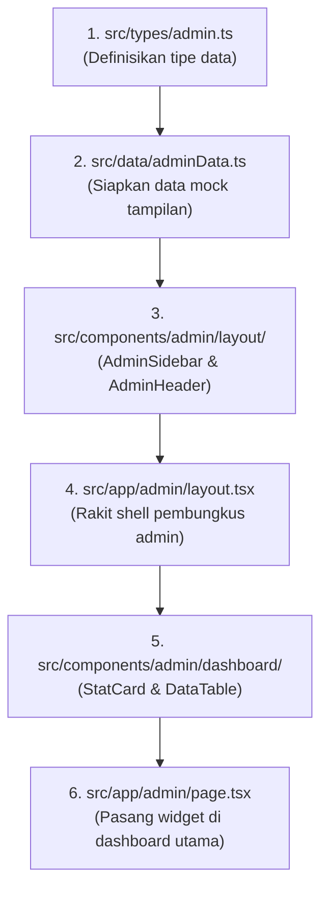

# Modesy Marketplace Clone — Arsitektur & Panduan Panel Admin

Dokumentasi ini merangkum **struktur proyek, status file terkini, dan rancangan implementasi Modesy Admin Panel** berbasis Next.js App Router, Tailwind CSS, dan Lucide React agar rapi, terstruktur, dan mudah dipahami.

---

## 📌 1. Gambaran Umum UI Modesy Admin Panel
Berdasarkan referensi dashboard admin Modesy (`modesy.codingest.net/admin/`), interface admin dibagi menjadi 3 area utama:

```
+---------------------------------------------------------------------------------------+
|  MODESY PANEL   | [=] Toggle   [View Site]   [English v]   [(Avatar) Admin v]         | <-- AdminHeader
+-----------------+---------------------------------------------------------------------+
| (Avatar) Admin  |                                                                     |
| * Online        | [ 41 Orders ]   [ 47 Products ]   [ 0 Pending ]   [ 15 Members ]    | <-- 4 StatCard
|                 +-----------------------------------+---------------------------------+
| > NAVIGATION    |                                   |                                 |
| > ORDERS        | Latest Orders                     | Latest Transactions             |
| > PRODUCTS      | - #10041 | $60.20 | Processing    | - #10033 | $191.10 | Succeeded  | <-- Data Widgets
| > PAYMENTS      | - #10040 | $138   | Processing    | - #10031 | $257    | Succeeded  |     (Baris 1)
| > CONTENT       | [View All]                        | [View All]                      |
| > MEMBERSHIP    +-----------------------------------+---------------------------------+
| > MANAGEMENT    | Latest Products                   | Latest Pending Products         | <-- Data Widgets
| > SETTINGS      | (Daftar produk terbaru)           | (Daftar produk approval)        |     (Baris 2)
| [v Backup DB]   | [View All]                        | [View All]                      |
+-----------------+-----------------------------------+---------------------------------+
     ^
AdminSidebar
```

---

## 📁 2. Peta Struktur File Lengkap Proyek

Berikut adalah struktur file lengkap proyek saat ini beserta statusnya:

> **Keterangan Status:**
> - 🟢 **[SUDAH ADA & AKTIF]** : File frontend/toko utama yang sudah berfungsi normal (jangan diubah).
> - 🟡 **[SUDAH ADA, PERLU DIISI]** : File/folder sudah dibuat di proyek Anda, namun kodenya masih kosong (*0 bytes*) atau masih *placeholder*.
> - 🔵 **[PERLU DITAMBAHKAN]** : File baru pendukung agar tampilan admin langsung hidup dengan data dummy.

```text
modesy-dupl/
├── public/                                      # File aset statis (gambar, icon, logo)
├── src/
│   │
│   ├── types/
│   │   └── 🟡 admin.ts                          # [SUDAH ADA - MASIH 0 BYTES]
│   │                                            # Definisi interface: AdminStat, AdminOrder,
│   │                                            # AdminTransaction, AdminNavItem, StatusBadge
│   │
│   ├── data/
│   │   ├── 🟢 products.ts, categories.ts, dll.  # [SUDAH ADA] - Data katalog toko frontend
│   │   └── 🔵 adminData.ts                      # [PERLU DITAMBAHKAN]
│   │                                            # Data dummy angka metrik (41, 47, 0, 15),
│   │                                            # daftar order/transaksi & menu lengkap sidebar
│   │
│   ├── components/
│   │   ├── 🟢 home/                             # [SUDAH ADA] - Hero, NewArrivals, ClothingSection, dll.
│   │   ├── 🟢 layout/                           # [SUDAH ADA] - Header, Navbar, Footer depan
│   │   ├── 🟢 product/                          # [SUDAH ADA] - ProductCard, ProductGrid
│   │   │
│   │   └── admin/                               # [FOLDER KOMPONEN ADMIN]
│   │       ├── 🟡 AdminHeader.tsx               # [SUDAH ADA - MASIH 0 BYTES]
│   │       │                                    # Topbar putih: Hamburger toggle, tombol "View Site",
│   │       │                                    # dropdown bahasa & profil Admin
│   │       │
│   │       ├── 🟡 AdminSidebar.tsx              # [SUDAH ADA - MASIH 0 BYTES]
│   │       │                                    # Sidebar gelap: Brand logo, user status online,
│   │       │                                    # 8 grup menu accordion & tombol backup database
│   │       │
│   │       ├── 🟡 StatCard.tsx                  # [SUDAH ADA - MASIH 0 BYTES]
│   │       │                                    # Kartu metrik: Angka besar + label + watermark icon
│   │       │                                    # Warna: Hijau/Teal, Ungu, Merah, Kuning
│   │       │
│   │       ├── 🟡 StatusBadge.tsx               # [SUDAH ADA - MASIH 0 BYTES]
│   │       │                                    # Pill badge untuk status (Processing, Succeeded, Pending)
│   │       │
│   │       ├── 🟡 DataTable.tsx                 # [SUDAH ADA - MASIH 0 BYTES]
│   │       │                                    # Tabel reusable untuk pesanan & transaksi terbaru
│   │       │
│   │       └── 🔵 CardWrapper.tsx               # [TAMBAHAN OPSIONAL]
│   │                                            # Container panel dengan header title, tombol (-) dan (x)
│   │
│   └── app/
│       ├── 🟢 (auth)/, member/, vendor/, dll.   # [SUDAH ADA] - Routing frontend toko
│       ├── 🟢 globals.css                       # [SUDAH ADA] - Konfigurasi tema Tailwind CSS
│       ├── 🟢 page.tsx                          # [SUDAH ADA] - Halaman utama frontend (katalog)
│       │
│       └── admin/                               # [ROUTING AREA PANEL ADMIN]
│           │
│           ├── 🟡 layout.tsx                    # [SUDAH ADA - MASIH SKELETON]
│           │                                    # Layout induk: Membungkus semua halaman admin
│           │                                    # dengan AdminSidebar (kiri) + AdminHeader (atas)
│           │
│           ├── 🟡 page.tsx                      # [SUDAH ADA - MASIH PLACEHOLDER]
│           │                                    # Dashboard Utama (/admin):
│           │                                    # Menampilkan 4 StatCard dan Grid Tabel
│           │
│           │   # --- SUB-HALAMAN YANG SUDAH TERSEDIA DI PROYEK ANDA ---
│           ├── 🟢 orders/                       # Kelola Pesanan
│           │   ├── page.tsx                     # List pesanan
│           │   ├── [id]/page.tsx                # Detail pesanan spesifik
│           │   └── bank-transfers/page.tsx      # Pembayaran transfer bank
│           │
│           ├── 🟢 products/                     # Kelola Produk
│           │   ├── page.tsx                     # List seluruh produk
│           │   ├── [id]/page.tsx                # Edit produk
│           │   └── pending/page.tsx             # Approval produk tertunda
│           │
│           ├── 🟢 categories/                   # Kelola Kategori
│           │   ├── page.tsx                     # List kategori
│           │   ├── create/page.tsx              # Tambah kategori
│           │   └── custom-fields/page.tsx       # Atribut produk custom
│           │
│           ├── 🟢 earnings/                     # Pendapatan
│           │   ├── page.tsx
│           │   └── seller-balances/page.tsx
│           │
│           ├── 🟢 payouts/                      # Pencairan Dana
│           │   ├── page.tsx
│           │   └── settings/page.tsx
│           │
│           ├── 🟢 users/                        # Manajemen Pengguna & Vendor
│           │   ├── page.tsx
│           │   ├── roles/page.tsx
│           │   ├── shop-requests/page.tsx
│           │   └── vendors/page.tsx
│           │
│           ├── 🟢 settings/                     # Pengaturan Sistem
│           │   ├── general/page.tsx
│           │   ├── payments/page.tsx
│           │   └── visual/page.tsx
│           │
│           ├── 🟢 pages/page.tsx                # Halaman Statis (Tentang Kami, dll)
│           └── 🟢 slider/page.tsx               # Pengaturan Banner Carousel Depan
```

---

## 🧭 3. Rincian Elemen UI Sesuai Screenshot Modesy

### A. Top Navigation Bar (`AdminHeader.tsx`)
| Elemen | Posisi | Deskripsi & Interaksi |
| :--- | :--- | :--- |
| **Hamburger Menu** | Kiri | Tombol untuk buka/tutup (collapse) sidebar di desktop & mobile |
| **Button "View Site"** | Kanan | Tombol hijau pill dengan ikon eksternal untuk kembali ke halaman toko utama (`/`) |
| **Language Dropdown** | Kanan | Dropdown bahasa aktif (default: *English*) |
| **Admin Profile** | Kanan | Avatar bulat + teks "Admin" + icon caret dropdown |

### B. Sidebar Navigasi (`AdminSidebar.tsx`)
Berlatar gelap (`#222d32` / `#1e293b`) dengan susunan menu:
1. **Header Sidebar**: Logo **"Modesy Panel"** dan Kartu Status Admin (Avatar, nama "Admin", status titik hijau "● Online").
2. **Kategori Menu**:
   - **NAVIGATION**: Home (Dashboard), Theme, Slider, Homepage Manager
   - **ORDERS**: Orders (dropdown), Digital Sales, Refund Requests
   - **PRODUCTS**: Products (dropdown), Quote Requests, Categories, Tags, Brands, Custom Fields
   - **PAYMENTS**: Payments (dropdown), Earnings (dropdown), Payouts (dropdown)
   - **CONTENT**: Pages, Blog (dropdown), Location (dropdown)
   - **MEMBERSHIP**: Membership (dropdown), Roles & Permissions
   - **MANAGEMENT TOOLS**: Help Center, Cache System, SEO Tools, Ad Spaces, Chat, Contact Messages, Reviews, Comments, Newsletter, Affiliate, Abuse Reports, Email Blacklist
   - **SETTINGS**: Preferences, Settings (General, Payments, Visual)
3. **Footer Sidebar**: Tombol biru/gelap **"Download Database Backup"** dengan ikon unduh.

### C. Dashboard Page (`app/admin/page.tsx`)
1. **4 Kartu Ringkasan (Stat Cards)**:
   - **Orders**: `41` (Warna Hijau/Teal `#16a085`, ikon Shopping Cart di background)
   - **Products**: `47` (Warna Ungu `#6c5ce7`, ikon Basket)
   - **Pending Products**: `0` (Warna Merah/Coral `#e74c3c`, ikon Eye-Off)
   - **Members**: `15` (Warna Oranye/Kuning `#f39c12`, ikon Users)
2. **Widget Tabel Baris 1**:
   - **Latest Orders**: Kolom `Order`, `Total`, `Status` (Badge Processing), `Date`, `Details` (tombol toska), dan tombol **"View All"** di footer.
   - **Latest Transactions**: Kolom `Id`, `Order`, `Payment Amount`, `Payment Method`, `Status` (Badge Succeeded), `Date`, dan tombol **"View All"**.
3. **Widget Tabel Baris 2**:
   - **Latest Products**: Tabel ringkas produk terbaru + tombol **"View All"**.
   - **Latest Pending Products**: Tabel produk menunggu kurasi + tombol **"View All"**.

---

## 🛠️ 4. Panduan Tahapan Pengisian Kode (Step-by-Step)

Ketika Anda siap mengisi kodenya, urutan pengerjaan yang paling mudah dan tidak membuat error adalah:



1. **Tahap 1: Tipe Data (`src/types/admin.ts`)**
   - Menulis interface TypeScript untuk data order, transaksi, item sidebar, dan stat card.
2. **Tahap 2: Mock Data (`src/data/adminData.ts`)**
   - Menyediakan data stat (41, 47, 0, 15), riwayat pesanan dummy, dan array daftar menu sidebar.
3. **Tahap 3: Navigasi & Shell (`AdminSidebar.tsx` & `AdminHeader.tsx`)**
   - Mengisi komponen sidebar dan header lengkap dengan styling Tailwind dan ikon dari `lucide-react`.
4. **Tahap 4: Admin Shell (`src/app/admin/layout.tsx`)**
   - Menghubungkan sidebar dan header agar selalu muncul di semua rute `/admin/*`.
5. **Tahap 5: Komponen Dashboard (`StatCard.tsx`, `DataTable.tsx`, `StatusBadge.tsx`)**
   - Membuat komponen widget kartu metrik dan tabel.
6. **Tahap 6: Dashboard Page (`src/app/admin/page.tsx`)**
   - Memanggil `StatCard` dan `DataTable` agar halaman `/admin` menampilkan dashboard lengkap seperti pada tangkapan layar.

---

## 🚀 Menjalankan Proyek
Untuk melihat hasil proyek saat pengembangan:
```bash
npm run dev
```
Akses halaman admin di browser:
👉 **`http://localhost:3000/admin`**
